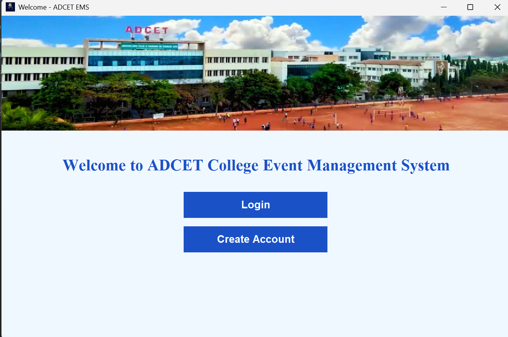
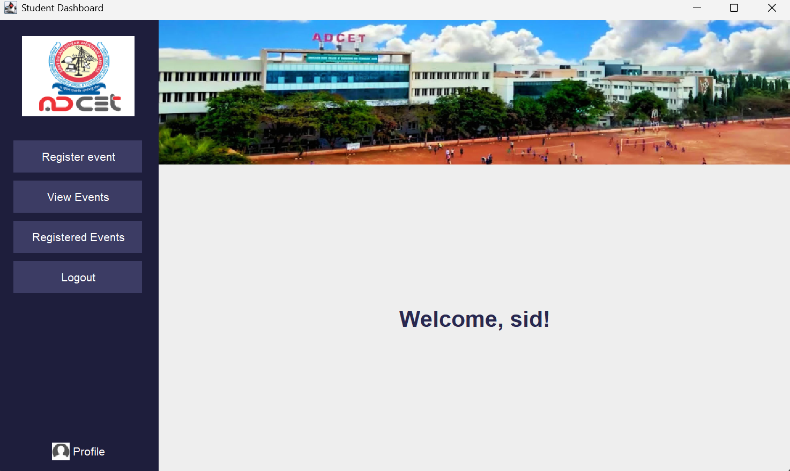
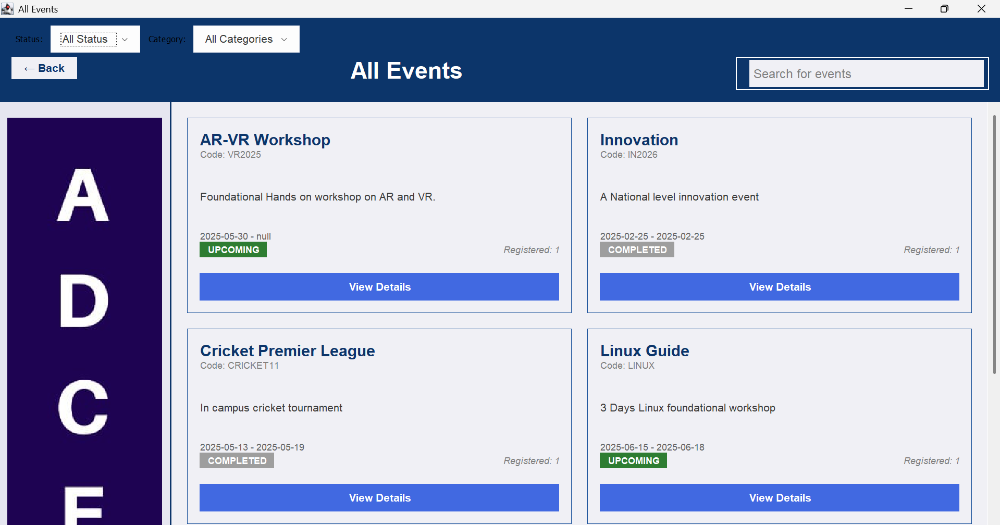
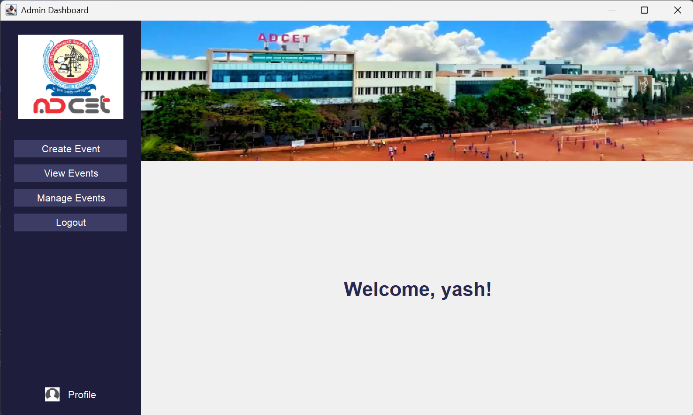
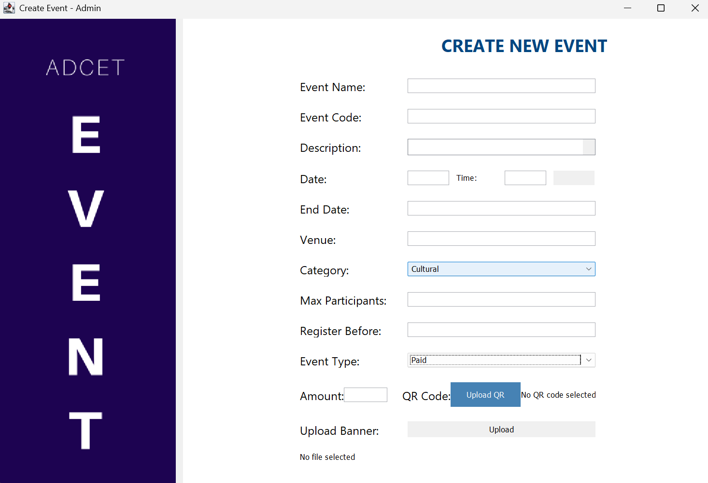
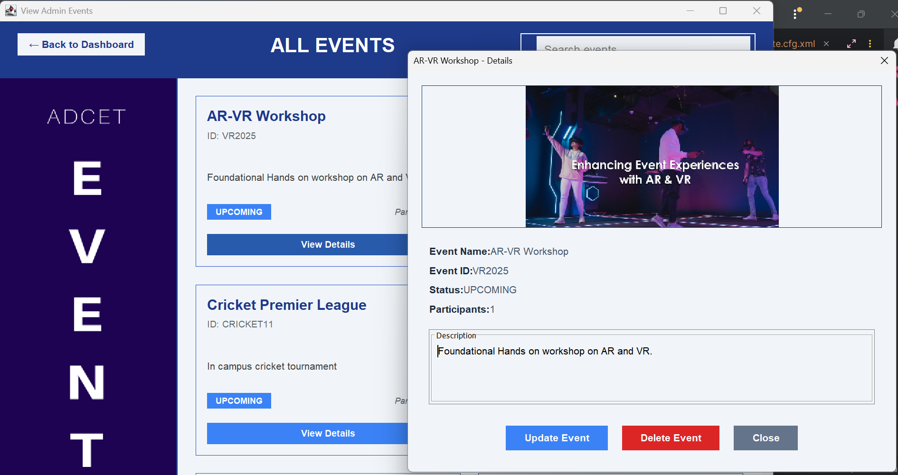
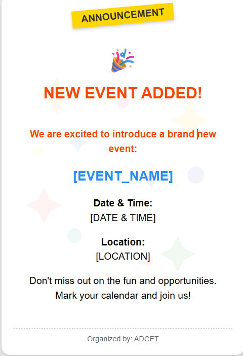

# College Event Management System (CEMS)

A Java Swing-based desktop application designed to streamline the management and registration of college events. This system enables students to view and register for events while allowing admins to efficiently create, update, and manage event data through a user-friendly interface.

---

## 📌 Project Overview

This project aims to digitize and simplify college event workflows that are traditionally managed manually, leading to miscommunication and inefficiency. CEMS offers a unified solution for both students and administrators to interact seamlessly through a desktop interface.

---

## 🎯 Objectives

- Allow students to **register and participate** in college events.
- Enable admins to **create, manage, and track** events.
- Store event data **securely in a MySQL database**.
- Enhance **communication through notifications**.
- Provide an **intuitive GUI using Java Swing**.

---

## 🧰 Tools & Technologies

| Layer               | Tools Used                        |
|---------------------|-----------------------------------|
| Language            | Java (JDK 17)                     |
| IDE                 | IntelliJ IDEA / Eclipse / VS Code |
| GUI                 | Java Swing                        |
| Database            | MySQL                             |
| ORM Tool            | Hibernate                         |
| Logging             | SLF4J (Simple)                    |
| Dependency Manager  | Maven                             |
| Utilities           | Lombok                            |
| Email Notifications | Jakarta Mail                      |

---

## 🖼️ GUI Screenshots

> _Below are the UI sections of the system. You can replace each bullet point with actual image links later._

- **Log In & Create Account**
  

- **Student Dashboard**
  

- **Event Dashboard**
  

- **Admin Dashboard**
  

- **Event Creation Page**
  

- **Admin Event Management**
  

- **Mail Notification Template**
 # 
---